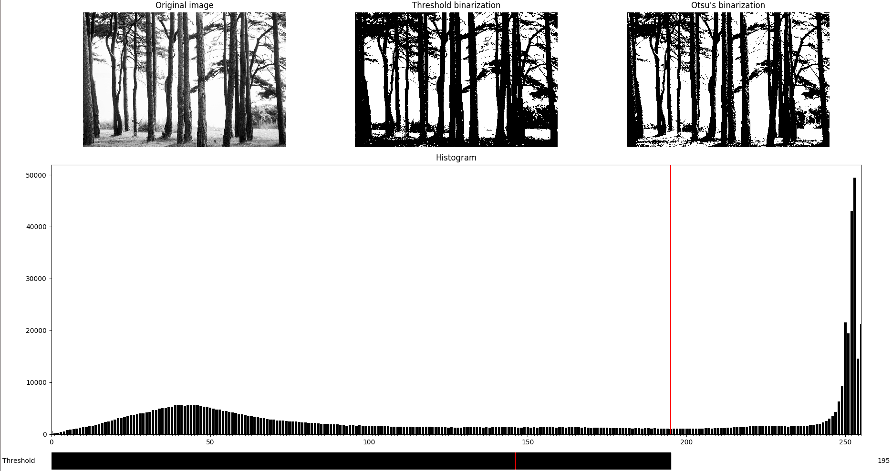

# Image binarization

## Table of contents

* [General info](#general-info)
* [Technologies](#technologies)
* [Launch](#launch)
* [Example of use](#example-of-use)
* [Histogram calculation](#histogram-calculation)
* [Threshold binarization](threshold-binarization)
* [Otsu's algorithm](otsus-algorithm)

## General info

The program binarizes an image with
manual threshold selection by histogram and
using Otsu's method.

## Technologies

* python = 3.6
* matplotlib = 3.1
* numpy = 1.17
* pillow = 6.2

`Pipfile` and `Pipfile.lock` are present in the repository.

## Launch

To launch the program, run
```bash
python main.py image_path
```
from the `lab1-histogram` directory.
`image_path` can be either relative or absolute.

## Example of use



The left image is the original one.
The center image is binarized manually from the threshold value you pick in slider (it is represented as a red vertical line on the image histogram).
The right image is binarized using Otsu's algorithm.

## Histogram calculation

`H[i]` is a number of pixels that have intensity `i`, where `H` is an array of histogram values.

## Threshold binarization

The threshold is `T` and and input image is `I`.
Then `BI[i, j] = 0` if `I[i, j] >= T` and `BI[i, j] = 1` if `I[i, j] < T`, where `BI` is a rezult binarized image.

## Otsu's algorithm

1. Calculate a histogram `H(I)`
2. Calculate probabilities of pixels with intensity `i`: `p(i) = H(i) / sum_i(H(i))` for each possible intentisy `i in [0, 255]`
3. For each value of threshold `t in [0, 255]` calculate total probabilities of two groups: `q1(t) = sum_{i=0}^t p(i)` and `q2(t) = sum_{i=t+1}^255 p(i) = 1 - q1(t)`
4. For each value of threshold `t in [0, 255]` calculate mean values of groups: `mu1(t) = sum_{i=0}^t i * p(i) / q1(t)` and `mu2(t) = sum_{i=t+1}^255 i * p(i) / q2(t)`
5. For each value of threshold `t in [0, 255]` calculate intergroup dispersion: `sigma^2(t) = q1(t) * q2(t) * [mu1(t) - mu2(t)]^2`
6. The optimal threshold is equal to `argmax_t sigma^2(t)`
