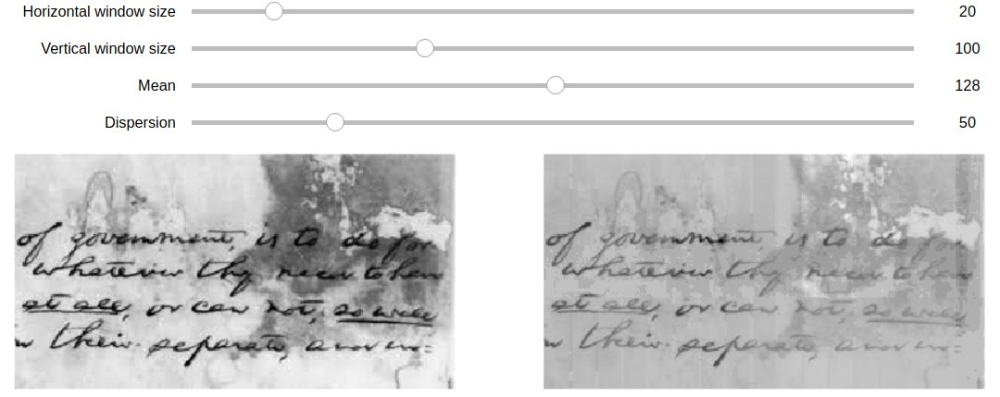
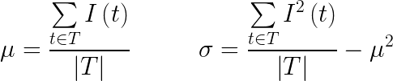
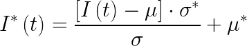

# Image normalization

## Table of contents

* [General info](#general-info)
* [Technologies](#technologies)
* [Launch](#launch)
* [Example of the result](#example-of-result)
* [Algorithm description](#algorithm-description)

## General info

The program performs local grayscale image normalization by intensities
of rectangular areas by the given value of average intensity and dispersion
(for example, `128` and `20`) using
integral data representation about the image.

## Technologies

* python = 3.6
* matplotlib = 3.1
* numpy = 1.17
* pillow = 6.2
* jupyter = 1.0
* pytest = 5.2

`Pipfile` and `Pipfile.lock` are present in the repository.

## Launch

Jupyter notebook was created for comfortable visualization.
To launch the notebook, run
```bash
pipenv run jupyter notebook
```
from activated pipenv environment.

## Example



The left image is the original one.
The right image is normalized with the given parameters,
that can be chosen manually using sliders (the result will be updated itself).

## Algorithm description

Split the image into a rectangular grid.

For each rectangle calculate mean and dispersion using
integral data representation of the image



where
* `I(t)` is intensity in pixel `t`
* `T` is a rectangular area of the image

For each rectangle the function of pixel intensities of image `I(t)` with
mean intensity `𝜇` and dispersion `σ` is changed into a function,
that gives mean intensity `𝜇*` and dispersion `σ*`



To ensure that the edges of rectangles are not too noticeable,
it is needed to intersect rectangles instead of using a grid.
In areas of intersection chose an average value of normalized intensities.
