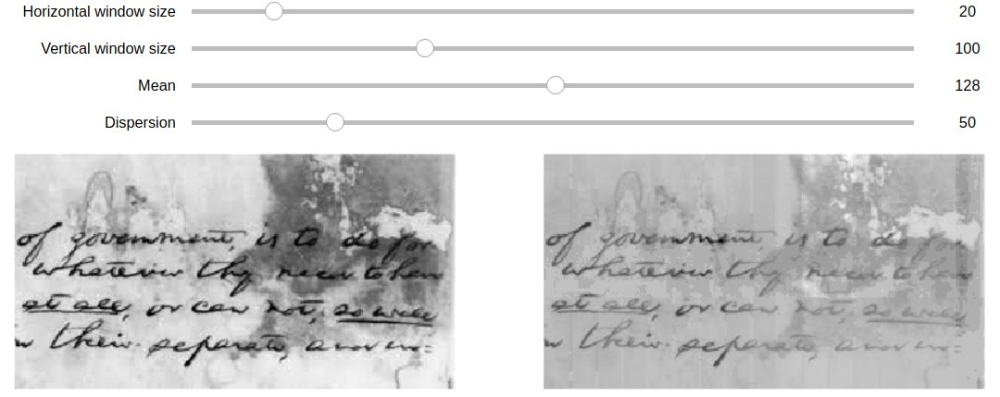

# Image binarization

## Table of contents

* [General info](#general-info)
* [Technologies](#technologies)
* [Launch](#launch)
* [Example of the result](#example-of-result)

## General info

The program performs local grayscale image normalization by intensities
of rectangular areas by the given value of average intensity and dispersion
(for example, `128` and `20`) using
integral data representation about the image.

## Technologies

* python = 3.6
* matplotlib = 3.1
* numpy = 1.17
* pillow = 6.2
* jupyter = 1.0
* pytest = 5.2

`Pipfile` and `Pipfile.lock` are present in the repository.

## Launch

Jupyter notebook was created for comfortable visualization.
To launch the notebook, run
```bash
pipenv run jupyter notebook
```
from activated pipenv environment.

## Example



The left image is the original one.
The right image is normalized with the given parameters,
that can be choosen manually using sliders (result will be updated itself).
