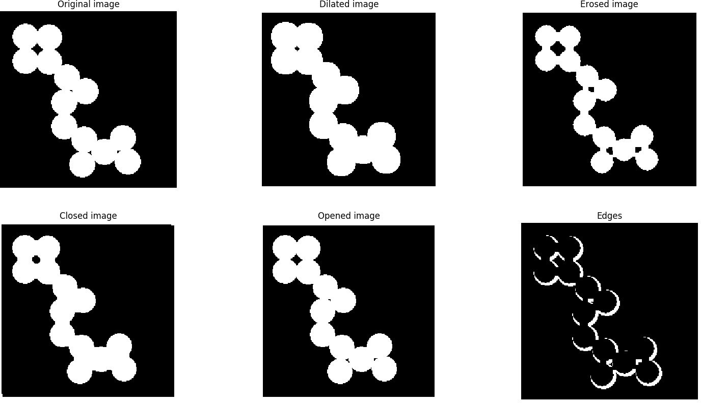
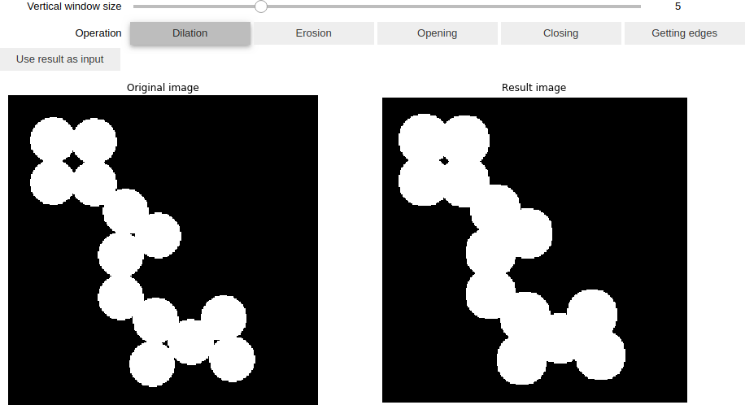
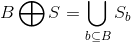
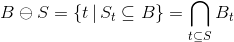

# Morphological operations

## Table of contents

* [General info](#general-info)
* [Technologies](#technologies)
* [Launch](#launch)
* [Example of the result](#example-of-result)
* [Morphological operations description](#operations-description)

## General info

The program performs opening and closing operations on binary images.

## Technologies

* python = 3.6
* matplotlib = 3.1
* numpy = 1.17
* pillow = 6.2
* jupyter = 1.0

`Pipfile` and `Pipfile.lock` are present in the repository.

## Launch

To activate the environment, run
```bash
pipenv shell
```
from the repository directory.

Jupyter notebook was created for comfortable visualization.
To launch the notebook, run
```bash
pipenv run jupyter notebook
```
from activated pipenv environment.

You can also see the result of implemented morphological operations using
```bash
python main.py image_path
```
from activated pipenv environment.

## Example

Using `main.py`


Using jupyter notebook


Clicking on `Using result as input` button, you can perform morphological operations on the resulting image after the last performed operation.

## Morphological operations description

### Dilation

Dilation of binary image `B` by structural element `S` is written as `B ⊕ S` and is determined as



where `Sb` is a structural element.
Usually, it is a black square.

### Erosion

Erosion of binary image `B` by structural element `S` is written as `B ⊝ S` and is determines as



### Closing

Closing of binary image `B` by structural element `S` is written as `B ∙ S` and is determined as `B ∙ S = (B ⊕ S) ⊖ S`.

The closing operation removes small white "holes" on a black background and white deepenings on object borders.

### Opening

The opening of binary image `B` by structural element `S` is written as `B ∘ S` and is determined as `B ∘ S = (B ⊖ S) ⊕ S`.

The opening operation allows getting rid of small black "ejections" on object borders.

### Getting object borders

Object borders are obtained after subtraction of a binary image from the image after erosion.
