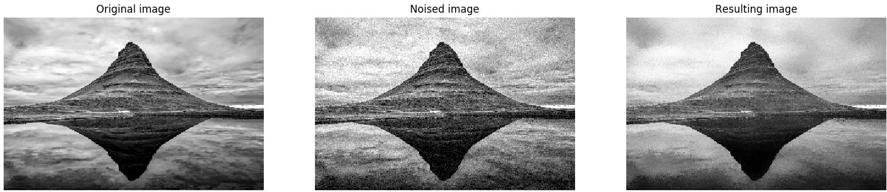
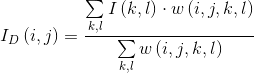
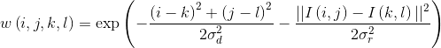

# Bilateral filtering

## Table of contents

* [General info](#general-info)
* [Technologies](#technologies)
* [Launch](#launch)
* [Example of the result](#example-of-result)
* [Algorithm description](#algorithm-description)

## General info

The program performs Gaussian smoothing of an image with saving relatively big
intensity gradients (edges) on the image.

## Technologies

* python = 3.6
* matplotlib = 3.1
* numpy = 1.17
* pillow = 6.2

`Pipfile` and `Pipfile.lock` are present in the repository.

## Launch

To launch the program, run
```bash
python src/main.py path_to_image
```
from the activated pipenv environment.

## Example



The left image is the original one.
The center image is noised with Gaussian noise `N(0, 20)`.
The right image is denoised with a bilateral filter with window radius `20`,
and smoothing parameters equal to `1600`.

## Algorithm description

The denoised intensity of pixel `(i, j)` is



where



where `σ_d` and `σ_r` are smoothing parameters, and `I(i, j)` and `I(k, l)` are intensities of pixels `(i, j)` and `(k, l)` respectively.
