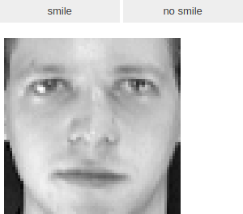
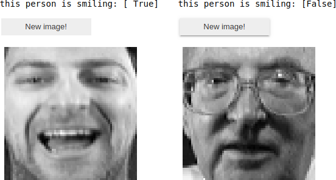

# Smile detection

## Table of contents

* [General info](#general-info)
* [Technologies](#technologies)
* [Launch](#launch)
* [Example of the result](#example-of-result)
* [Algorithm description](#algorithm-description)

## General info

The program traines support vector machine using sklearn python library on
dataset on [Olivetti faces dataset](https://scikit-learn.org/0.19/datasets/olivetti_faces.html).
The training dataset is obtained manually by
marking protos of smiling and non-smiling people.

## Technologies

* python = 3.6
* matplotlib = 3.1
* numpy = 1.17
* pillow = 6.2
* sklearn = 0.22
* jupyter = 1.0

`Pipfile` and `Pipfile.lock` are present in the repository.

## Launch

To launch the program, run
```bash
pipenv run jupyter notebook
```
from the activated pipenv environment.
Then, read comments and follow instructions.

## Example

To train the SVM, click on "smile" or "not smile" button.



Here is an example of detected and not detected smile.


