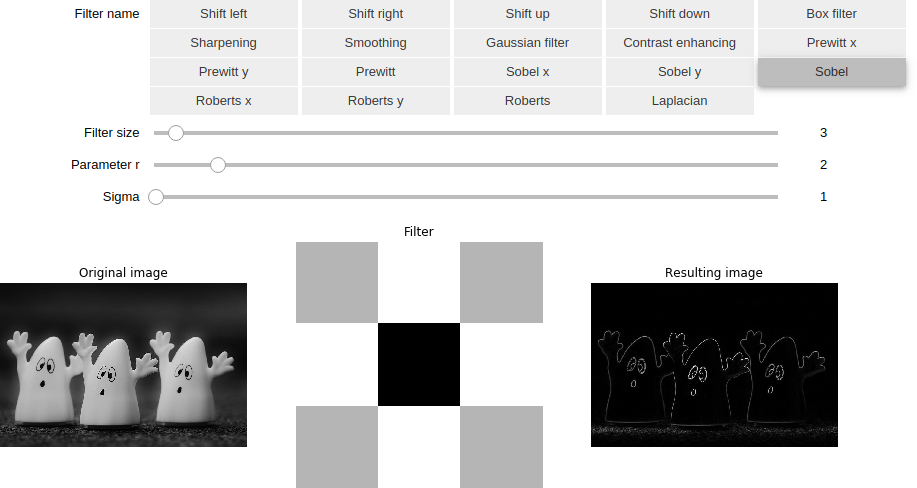

# Linear filtration

## Table of contents

* [General info](#general-info)
* [Technologies](#technologies)
* [Launch](#launch)
* [Example of the result](#example-of-result)

## General info

The program performs linear filtation on images.
The next filters were implemented: shifting by one pixel to different sides,
sharpening and smoothing filters, Gaussian filter, contrast enhacing filter,
Prewitt, Sobel, and Roberts differential filters, and Laplacian filter.

## Technologies

* python = 3.6
* matplotlib = 3.1
* numpy = 1.17
* pillow = 6.2
* jupyter = 1.0

`Pipfile` and `Pipfile.lock` are present in the repository.

## Launch

To launch the program, run
```bash
pipenv run jupyter notebook
```
from the activated pipenv environment.
Then, read comments and follow instructions.

## Example

Here is an example of GUI to choose the filter and the result.



For some of the filters it is possible to change filter size and some parameters.
