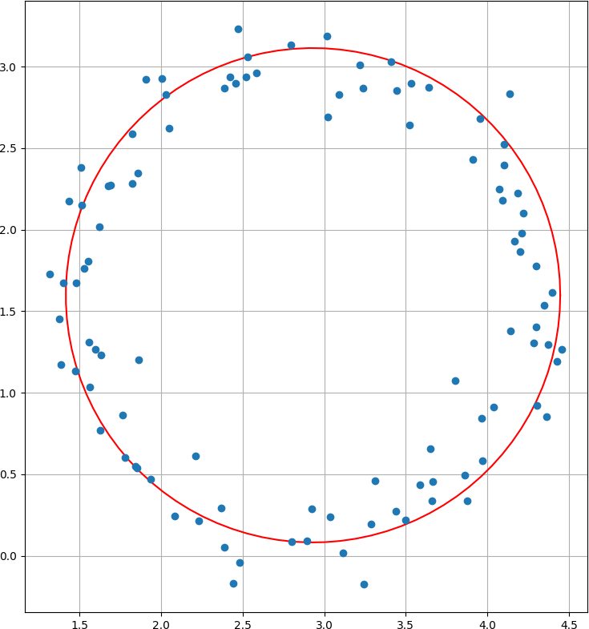

# RANSAC circle detection

## Table of contents

* [General info](#general-info)
* [Technologies](#technologies)
* [Launch](#launch)
* [Example of the result](#example-of-result)

## General info

The program performs RANSAC circle detection.
Given [a set of points that approximately form a circle](https://relate.cs.illinois.edu/course/cs357-f15/file-version/03473f64afb954c74c02e8988f518de3eddf49a4/media/newton2/CircleFit.html),
using [RANSAC algorithm](https://youtu.be/nG5QC_WFdGU),
a center and a radius of the circle is detected.

## Technologies

* python = 3.6
* matplotlib = 3.1
* numpy = 1.17
* pillow = 6.2

`Pipfile` and `Pipfile.lock` are present in the repository.

## Launch

To launch the program, run
```bash
python circle.py
```
from the activated pipenv environment.

## Example

Here is an example of given points (blue) and detected circle (red).


